# CNN_HW_PROJ

## Abstract
해당 프로젝트의 목표는 Google TPU[(Tensor Proecssing Unit)](https://cloud.google.com/blog/products/ai-machine-learning/an-in-depth-look-at-googles-first-tensor-processing-unit-tpu)와 유사한 구조의 머신러닝을 위한 co-processor 설계에 있다.

[[Google TPU 논문]](https://arxiv.org/abs/1704.04760)

SW stack에서 target DNN모델을 training시킨 후 HDL로 구현한 HW 모듈 위에서 inferencing과정을 진행, performance 요소들을 평가한다.
Inferencing 과정을 위해서 독립적인 Convolution, Fully Connected, Max Pooling layer들을 구현하였다. 
Convolution layer연산은 im2col, ifmap stationary방식을 채택하였고, ifmap과 Weight에 quatization이 적용된다.  
#

## Design Spec

### FPGA Board : Zybo Z7 20
- FPGA part                 : XC7Z020-1CLG400C  
- 1 MSPS On-chip ADC        : Yes 
- Look-up Tables (LUTs)		: 53,200 
- Flip-flops                : 106,400 
- Block RAM		            : 630 KB 
- Clock Management 	        : 4 
- Available Shield I/O		: 40 
- Total Pmod Ports		    : 6 
- Fan Connector		        : Yes 
- Zynq Heat Sink            : Yes 
- HDMI CEC Support		    : TX and RX ports 
- RGB LEDs		            : 2 

[ZYBO Reference Manual](https://www.xilinx.com/content/dam/xilinx/support/documents/university/XUP%20Boards/XUPZYBO/documentation/ZYBO_RM_B_V6.pdf)  
#

### DNN Model : MNIST Classifier

### Quantization
- data type -> unsigned int8

### MAC Operation
- Using FPGA DSP, 10 < latency < 20(ns) (1clock = 10ns)

### SRAM (FPGA BRAM) 
- Port        : True_dual_port_ram 
- Latency     : R/W = 1clk 
- Size        : 640kB 
- Bandwidth   : 512 bit per cycle  
#

## AXI BUS
- Convolution layer의 Matrix multiplication을 위해선 이전 layer의 output인 tensor를 im2col변환 이후에 matrix형태로 전달될 필요가 있다. 
- SW stack에서 im2col변환을 수행하기 위해서 BRAM 과 Zynq프로세서 사이의 통신에 AMBA protocol의 일종인 AXI bus를 이용하였다.

  
#

## Architecture

### 1. Convolution layer

#### 1-1) Conv Data Mover
- BRAM에서 conv연산을 위한 ifmap과 weight를 주소값을 통해 호출하고, ifmap은 SA(Systolic Array)로 preload시키고, weight는 GLB로 전달한다. 

#### 1-2) Global Buffer(GLB)
- Conv Data Mover로부터 받아온 weight값들을 ifmap stationary연산을 위한 형태로 SA에 전달하기 위해서 buffering시킨다. 

#### 1-3) Systoilc Array(SA)
- 다수의 PE(Processing Element)가 서로 연결되어 ifmap, weight, partial sum을 전달한다. 
- Weight, Partial sum 값들은 PE에서 다른 PE로 forwarding될 때 valid신호도 동시에 전달된다. 
- PE연산과 primitive들의 data&valid(en) 신호들의 forwarding을 통해서 정방행렬 matrix 2개의 multiplication이 수행된다. 

#### 1-4) Accumulator
- FIFO와 adder의 조합으로 SA에서 전달받은 psum값을 psum_valid신호를 이용해서 fifo에 write한다.
- FIFO의 rdata를 feedback으로 사용, add 이후에 다시 FIFO에 write하는 방식으로 accumulation을 수행한다.  

#### 1-5) SA Data Mover
- Accumulator로부터 전달받은 ofmap 값들을 buffer에 저장하고 BRAM에 write하는 동작을 수행한다.  
#

### 2. FC layer
  
#

#### 2-1) FC DATA Mover
- BRAM 2개(BRAM0 & BRAM1)로부터 data 를 읽거나 써 주는 Module
- State : IDLE/RUN/DONE, IDLE state 에서 controller로부터 run_i와 run_count_i를 받아 동작
- BRAM0에 operand를 R/W해서 연산Core 통과 -> 나오는 결과값을 BRAM1에 저장(Max Pooling으로 전달)  
# 
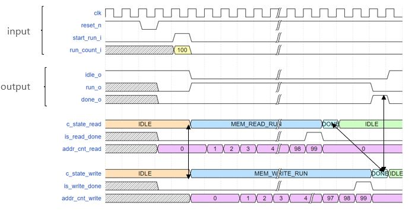  

#

#### 2-2) FC Calculation Core
- Operand 2 개를 받음, 두개를 곱하고 가지고 있던 결괏값에 accumulate MAC 연산은 Timing violation 일으킴 
- Multiplication retiming 문제(clk latency < MAC)는 FF을 이용한 Pipelining으로 해결

#### 2-3) Result Writer
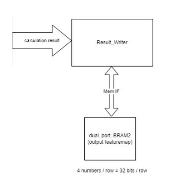  
#
- Data mover 가 1 번의 IDLE-RUN-DONE을 끝낼 때마다 동작
- 8bit 의 연산 결괏값이 그 결괏값이 4의 배수 개로 튀어나올 때마다 BRAM2 에 써 줘야 함(FC2 를 위해)  
#

#### 2-4) FC BRAM Addressing
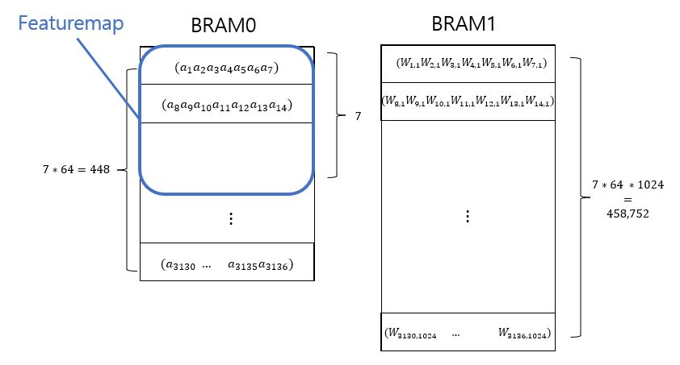  
#
BRAM0
- conv layer output featuremap volume 7 x 7 x 64
- 7 x 7 feature map이 BRAM row에 1장씩 저장되어 있음
- Row 하나를 읽어와서 7개의 숫자를 Core 1 ~ 7 에 집어넣음(𝑎_𝑖: ith input neuron)

BRAM1
- Weight들을 row당 7개씩 저장해 놓음
- Row 하나를 읽어와서 7개의 숫자를 Core 1 ~ 7에 집어넣음
- 𝑊_(𝑖,𝑗): ith input neuron 에서 jth output neuron 으로 가는 weight
- Weight 저장에 있어 AXI4 Protocol 을 사용하여 전송할 수 있다고 가정 
- BRAM 의 용량 요구치: 약 3.212MB ((7x7x64)x1024 x8bit)
- Addr control 도 AXI4 Protocol 을 사용하여 수행할 수 있다고 가정  
#

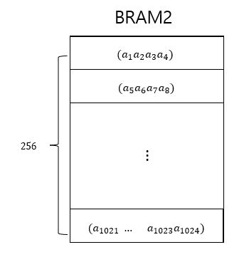  
#

BRAM2
- FC1 의 output 이자 FC2 의 input neuron 1024 개의 값들 저장  
#

### 3. Pooling layer
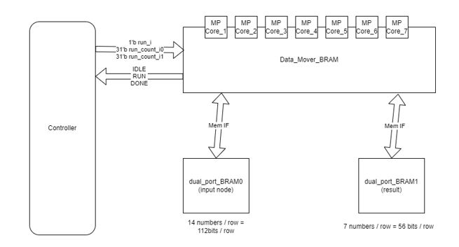  
#### 3-1) Pooling Core
- BRAM0 로부터 feature map을 가져와서 max_pooling 수행
- BRAM0 가 dual port 이므로 2개의 row씩 가져옴
- 가져온 2 x 14 개의 operand에 대해 MP수행, 결과값 2 x 7개 BRAM1에 Write
- BRAM0 에서 Data 를 Read 할 때, Row 를 2 개씩 가져와야 함
- BRAM0 와의 MEM IF 에서 addr을 주는 port, bram output 을 받는 port 가 각각 2개로 나눠짐
- Addr 하나는 1,3,5 , 다른 하나는 2,4,6 으로 증가하며 해당 row 의 data 를 읽어옴

#### 3-2) MP BRAM Addressing
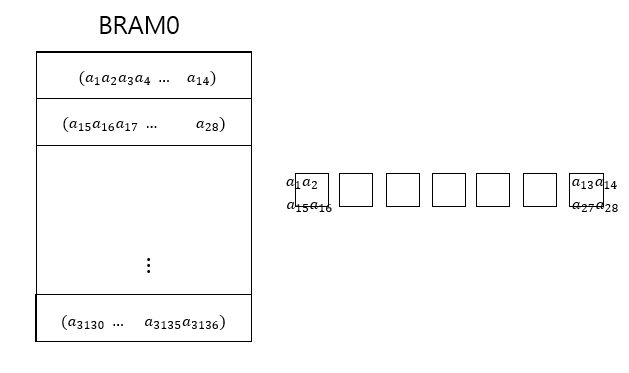  
#
- MP 동작에 의해 BRAM0 로부터 읽어온 ROW 개수의 절반에 해당하는 ROW를 Write(run_count_i0, run_count_i1)

# 

## Simulation

#### 1. Testbench Simulation
- Path: /SIM/
- Vivado 2021.2 simulator
- Vitis 2021.2

##### CONV SIM
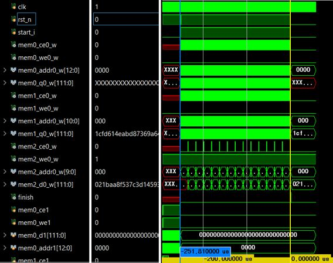  
#

##### FC SIM
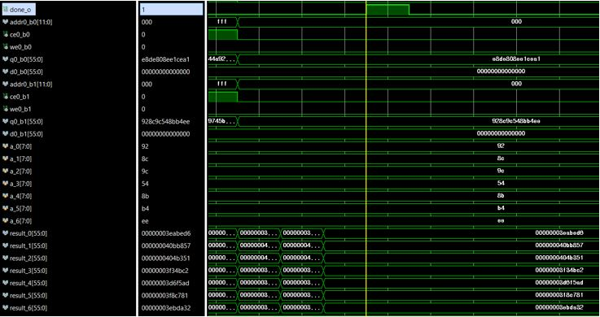  
#
##### MP SIM
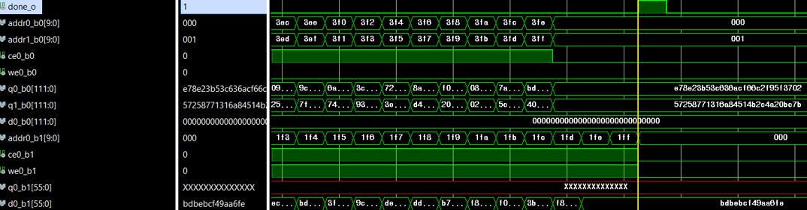  
#

#### 2. Golden Reference
- Path: /SW/
- 사용법
    1) golden_ref.c의 rand로 생성 되는 ifmap, weight txt파일 path 재설정
    2) Verilog tb_GEMM의 txt파일 open path 재설정
    3) Vivado simulation 실행 및 c로 생성된 ofmap 폴더와 verilog testbench로 생성된 ofmap 값 변경    
#

##### FC SIM
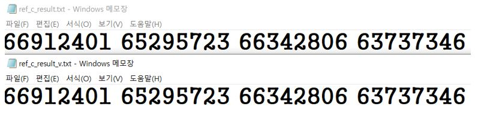  
#

##### MP SIM
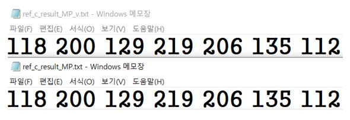  
#

## ETC
- Conv연산을 위한 MMU와 FC연산을 위한 연산 core의 scale은 해당 project의 target DNN model에 적합한 크기로 구현하였다. 
- verilog코드 내부의 parameter 값들을 변경하여 module의 크기를 변경하여 latency와 resource를 조절할 수 있다.  
#

## Version
1. 2022/07/18 : 1st