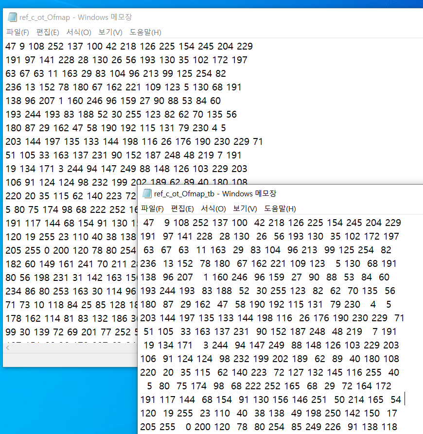

# TPU_HW_Verilog

## Abstract

The purpose of this project is designing downgrade TPU processor for DNN(Deep-Neural-Network), which is similar to Goggle TPU[(Tensor Proecssing Unit)](https://cloud.google.com/blog/products/ai-machine-learning/an-in-depth-look-at-googles-first-tensor-processing-unit-tpu)

[Google TPU Paper-2015](https://arxiv.org/abs/1704.04760)

In SW stack, training target DNN model for Image Processing, getting hyperparameter, inferencing process on HW stack whick is designed by Verilog HDL. For inferencing, designed Conv(convolution layer), FC(Fully Connected layer), Pool(Max Pooling layer).
Conv layer use im2col method. PE(Processing Unit) and SA(Systolic Array) is designed for ifmap stationary structure.
For downgrading this project, we use just 8bit weight and 8bit ifmap data and for this, quatization is applied.

## Design Spec

### FPGA Board : Zybo Z7 20

- FPGA part                 : XC7Z020-1CLG400C  
- 1 MSPS On-chip ADC        : Yes
- Look-up Tables (LUTs) : 53,200
- Flip-flops                : 106,400
- Block RAM : 630 KB
- Clock Management : 4
- Available Shield I/O : 40
- Total Pmod Ports : 6
- Fan Connector : Yes
- Zynq Heat Sink : Yes
- HDMI CEC Support : TX and RX ports
- RGB LEDs : 2

[ZYBO Reference Manual](https://www.xilinx.com/content/dam/xilinx/support/documents/university/XUP%20Boards/XUPZYBO/documentation/ZYBO_RM_B_V6.pdf)  

### DNN Model : MNIST Classifier

### Quantization

- data type -> unsigned int8

### MAC Operation

- Using FPGA DSP, 10 < latency < 20(ns) (1clock = 10ns)

### SRAM (FPGA BRAM)

- Port        : True_dual_port_ram
- Latency     : R/W = 1clk
- Size        : 640kB
- Bandwidth   : 512 bit per cycle

## AXI BUS

- For matrix multiplication on conv layer, before layer's output ifmap tensor need to be im2col transformed to matrix.
- For im2col transformation, use AXI interface for transfering BRAM to FPGA processor. We applied im2col transformation by Xilinx VITIS interface program.(2021.2 ver)

  

## Architecture

### 1. Convolution layer

#### 1-1) Conv Data Mover

- In BRAM, ifmap and weight for conv operation are called through address value, ifmap is preloaded into SA (Systolic Array), and weight is transmitted to GLB.

#### 1-2) Global Buffer(GLB)

- Buffers the weight values received from Conv Data Mover in order to transfer them to SA in the form for ifmap stationary operation.
  
#### 1-3) Systoilc Array(SA)

- Multiple PEs (Processing Elements) are connected to each other to deliver ifmap, weight, and partial sum.
- When the weight and partial sum values are forwarded from PE to another PE, the valid signal is also transmitted at the same time.
- Multiplication of two square matrices is performed through PE operation and forwarding of data&valid(en) signals of primitives.

#### 1-4) Accumulator

- As a combination of FIFO and adder, the psum value delivered from SA is written to fifo using the psum_valid signal.
- Accumulation is performed by using the rdata of the FIFO as feedback and writing it back to the FIFO after adding.

#### 1-5) SA Data Mover

- It stores the ofmap values received from the accumulator in the buffer and writes it to the BRAM.
  
### 2. FC layer

  

#### 2-1) FC DATA Mover

- Module that reads or writes data from 2 BRAMs (BRAM0 & BRAM1)
- State: Receive run_i and run_count_i from the controller in IDLE/RUN/DONE, IDLE state and operate
- R/W operand to BRAM0 and pass the operation core -> Save the resulting value to BRAM1 (transfer to Max Pooling)

  

#### 2-2) FC Calculation Core

- Received 2 operands, multiplying the two and accumulate the result on the result value that has been accumulated MAC operation causes a timing violation
- Multiplication retiming problem (clk latency < MAC) is solved by pipelining using FF

#### 2-3) Result Writer

  

- Operates every time the data mover finishes 1 IDLE-RUN-DONE
- 8-bit operation result must be written to BRAM2 whenever the result is a multiple of 4 (for FC2)

#### 2-4) FC BRAM Addressing

  

BRAM0

- conv layer output featuremap volume 7 x 7 x 64
- 7 x 7 feature maps are stored one by one in each BRAM row
- Read one row and insert 7 numbers into Core 1 ~ 7 (𝑎_𝑖: ith input neuron)

BRAM1

- Stores 7 weights per row
- Read one row and insert 7 numbers into Core 1 ~ 7
- 𝑊_(𝑖,𝑗): weight from ith input neuron to jth output neuron
- Assume that weight storage can be transmitted using AXI4 Protocol
- BRAM capacity requirement: Approx. 3.212MB ((7x7x64)x1024 x8bit)
- Assume that Addr control can also be performed using AXI4 Protocol

  

BRAM2

- Save 1024 values of FC1's output and FC2's input neurons

### 3. Pooling layer

  

#### 3-1) Pooling Core

- Get the feature map from BRAM0 and perform max_pooling
- Since BRAM0 is a dual port, 2 rows are fetched.
- Perform MP for 2 x 14 operands imported, write result value 2 x 7 to BRAM1
- When reading data from BRAM0, two rows must be fetched.
- In MEM IF with BRAM0, the port giving addr and the port receiving bram output are divided into two each.
- One Addr increases to 1,3,5 and the other increases to 2,4,6, and the data of the corresponding row is read.

#### 3-2) MP BRAM Addressing

  

- Write (run_count_i0, run_count_i1) a row corresponding to half the number of rows read from BRAM0 by MP operation
  
### Simulation

- Simulating with verilog testbench and golden ref below

#### 1. Testbench Simulation

- Path: /SIM/
- Vivado 2021.2 simulator
- Vitis 2021.2

##### CONV SIM in tb

  

##### FC SIM in tb

  

##### MP SIM in tb

  

#### 2. Golden Reference

- Path: /SW/
- How to use
     1) Reset the path of the ifmap and weight txt file created with rand of golden_ref.c
     2) Reset the txt file open path of Verilog tb_GEMM
     3) Run Vivado simulation and change the ofmap folder created with c and ofmap created with verilog testbench

##### Conv SIM in golden ref

-conv sim

##### FC SIM in golden ref

- fc sim
  

##### MP SIM in golden ref

- mp sim
  

## ETC

- For block diagram of conv layer, refer to /DOC/BLOCK_DIAGRAM/IFS_SA.drawio
- The scale of the MMU for Conv operation and the operation core for FC operation is implemented in a size suitable for the target DNN model of the project.
- You can adjust the latency and resources by changing the module size by changing the parameter values inside the verilog code.
- In the case of FC and MP, operation latency and bandwidth can be changed by changing the number of cores, but only FC7 and MP7 are listed above.

### Advance

- instruction design
- scalable code
- timing variation check

## Version

1. 2022/07/18 : 1st
